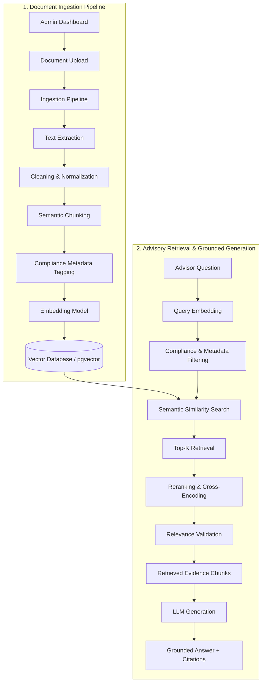

# Compliance-Grounded Financial Advisory RAG Architecture

## Overview

**FInee.ai** is designed to solve a critical compliance risk in financial advisory firms: ensuring advisors do not provide outdated, non-compliant, or hallucinated financial guidance. The platform operates on a strict **Retrieval-Augmented Generation (RAG)** architecture with deterministic evidence retrieval, compliance-based metadata filtering, and full source citation tracing.

---

## Architectural Flow



### Text Flow Diagram

```text
ADMIN DASHBOARD
        ↓
DOCUMENT UPLOAD
        ↓
INGESTION PIPELINE
        ↓
TEXT EXTRACTION
        ↓
CLEANING
        ↓
CHUNKING
        ↓
METADATA
        ↓
EMBEDDING MODEL
        ↓
VECTOR DATABASE
        ↓
ADVISOR QUESTION
        ↓
QUERY EMBEDDING
        ↓
METADATA FILTERING
        ↓
SEMANTIC SEARCH
        ↓
TOP-K RETRIEVAL
        ↓
RERANKING
        ↓
RELEVANCE VALIDATION
        ↓
RETRIEVED EVIDENCE
        ↓
LLM
        ↓
GROUNDED ANSWER + CITATIONS
```

---

## Core Architectural Principles

1. **Retrieved Context Isolation**:
   The Large Language Model (LLM) **does not directly read or browse the entire vector database**. Instead, the retrieval pipeline evaluates, selects, filters, and ranks the most relevant chunks before the LLM receives context in its prompt window.

2. **Compliance & Approval Filtering**:
   Only **approved and active documents** (factsheets, regulatory filings, disclosures) are eligible for advisory retrieval. Draft, archived, or unverified documents are excluded at the metadata filtering stage.

3. **Deterministic Source Tracing & Citations**:
   Every answer generated by the LLM is constrained strictly to the retrieved evidence. All statements include explicit citation references pointing to source document IDs, pages, and chunk IDs.

4. **Multi-Stage Refinement**:
   - **Semantic Search**: Fast Top-K candidate retrieval from pgvector.
   - **Reranking**: Secondary cross-encoder scoring for precision.
   - **Relevance Validation**: Rejecting low-confidence context before LLM prompt assembly.

---

## Implementation Roadmap

- **Phase 1 (Current)**: Environment setup, modular project structure, configuration management, and baseline API.
- **Phase 2**: Document ingestion pipeline (PDF/DOCX extraction, chunking strategies, metadata tagging).
- **Phase 3**: Vector database integration (PostgreSQL + pgvector) and embedding generation.
- **Phase 4**: Retrieval engine (hybrid search, compliance filtering, Top-K, and reranking).
- **Phase 5**: LLM prompt engineering, grounded advisory generation, and citation formatting.
- **Phase 6**: Advisory chat interface and administrative compliance dashboard.
