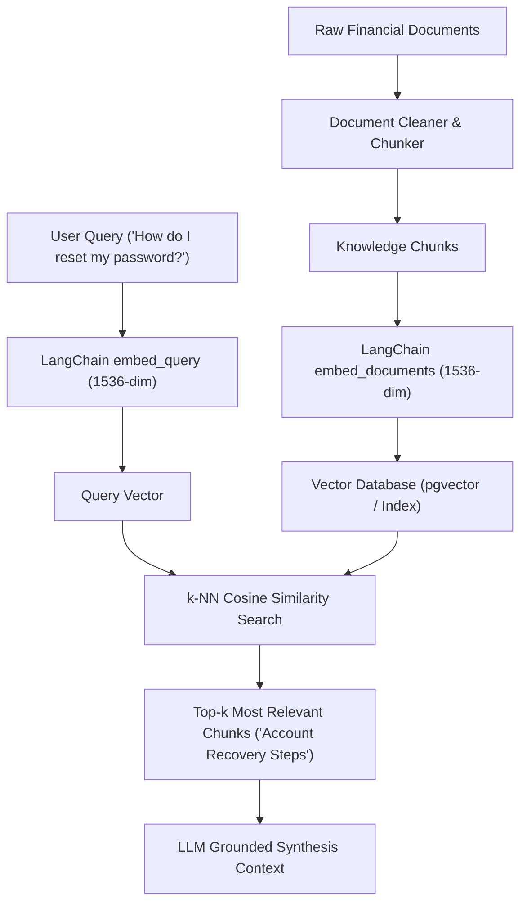

# Embeddings Fundamentals & Vector Representation (with LangChain)

## Overview

In Retrieval-Augmented Generation (RAG) systems such as **FInee.ai**, keyword matching (lexical search) is insufficient for accurate knowledge retrieval. Users often formulate queries using terminology that differs from the exact phrasing in indexed documents (for example, asking *"How do I reset my password?"* when the compliance knowledge base contains *"Account recovery steps"*).

**Vector embeddings** resolve this mismatch by converting textual chunks into dense numerical vectors that encode **semantic meaning**, placing conceptually related phrases close together in high-dimensional vector space.

FInee.ai leverages **LangChain Core Embeddings** (`Embeddings`, `embed_documents`, `embed_query`) to provide standard, production-ready integration across vector stores and retrieval chains.

---

## 1. What Vectors Represent in Plain Terms

### Vectors as Coordinates of Meaning
An embedding vector is **not**:
- A random unique identifier (UUID/integer ID).
- An arbitrary hash value.
- A simple frequency count of words (like Bag-of-Words or TF-IDF).

Instead, an embedding is a list of continuous numbers (coordinates) where each coordinate represents an abstract latent semantic feature learned during deep neural network training.

```text
"How do I reset my password?"      ───►  [-0.0113, -0.0211, ..., -0.0756]  (1536 dimensions)
"Steps to recover access to login"  ───►  [-0.0281, -0.0242, ..., -0.0625]  (1536 dimensions)
"The cafeteria menu has pasta today" ──►  [-0.0013, -0.0122, ..., -0.0324]  (1536 dimensions)
```

### Geometric Vector Space & Semantic Proximity
When texts are mapped into a high-dimensional vector space:
1. **Nearby Vectors (Small Angle / High Cosine Similarity)**: Represent texts sharing semantic intent, synonymy, or conceptual alignment.
2. **Distant Vectors (Large Angle / Low Cosine Similarity)**: Represent texts with orthogonal or unrelated themes.

---

## 2. LangChain Embeddings Integration

FInee.ai implements the standard LangChain `Embeddings` interface (`src/embeddings/embedder.py`):

```python
from src.embeddings import get_langchain_embeddings

embedder = get_langchain_embeddings()

# Embed multiple document chunks (Task 1)
docs_embeddings = embedder.embed_documents([
    "How do I reset my account password?",
    "Steps to recover access to my login",
    "The cafeteria menu has pasta today",
])

# Embed a user search query
query_vector = embedder.embed_query("How do I reset my account password?")
```

---

## 3. Vector Dimension & Dimensional Consistency

The **dimension** of an embedding vector corresponds to the total number of numeric coordinates in the vector (e.g., 1536 for OpenAI `text-embedding-3-small` / `text-embedding-ada-002`).

### Why Uniform Dimensionality Matters
- Every text input processed by the same embedding model produces a vector of identical length $d$.
- Uniform dimensionality enables linear algebra operations (dot products, Euclidean distance, matrix multiplications) across query vectors and document chunk vectors.

---

## 4. Measuring Semantic Proximity with Cosine Similarity

Cosine similarity evaluates the cosine of the angle $\theta$ between two vectors $\mathbf{u}$ and $\mathbf{v}$:

$$\text{Cosine Similarity}(\mathbf{u}, \mathbf{v}) = \frac{\mathbf{u} \cdot \mathbf{v}}{\|\mathbf{u}\| \|\mathbf{v}\|} = \frac{\sum_{i=1}^{d} u_i v_i}{\sqrt{\sum_{i=1}^{d} u_i^2} \sqrt{\sum_{i=1}^{d} v_i^2}}$$

### Properties
- **Range**: From $-1.0$ (opposite direction) to $+1.0$ (identical direction).
- **Scale Invariance**: Cosine similarity measures directional alignment rather than vector magnitude, making it robust against document length variations.

---

## 5. Demonstration Results

Executing the demonstration script (`scripts/demonstrate_embeddings.py`) yields the following evaluations:

### Scenario A: Authentication & Account Recovery
| Pair Category | Text A | Text B | Cosine Similarity |
| :--- | :--- | :--- | :---: |
| **Similar Pair** | `"How do I reset my account password?"` | `"Steps to recover access to my login"` | **`0.7304`** |
| **Dissimilar Pair** | `"How do I reset my account password?"` | `"The cafeteria menu has pasta today"` | **`0.4404`** |

> **Result**: The similar pair scored significantly higher than the dissimilar pair ($\Delta = +0.2899$), confirming semantic ranking.

### Scenario B: Financial Advisory Domain
| Pair Category | Text A | Text B | Cosine Similarity |
| :--- | :--- | :--- | :---: |
| **Similar Pair** | `"What is the annual yield on a high-interest savings account?"` | `"How much interest does a high-yield savings deposit earn annually?"` | **`0.8848`** |
| **Dissimilar Pair** | `"What is the annual yield on a high-interest savings account?"` | `"The football match was postponed due to heavy rain"` | **`0.4131`** |

> **Result**: The domain-specific similar pair scored substantially higher than the unrelated pair ($\Delta = +0.4718$).

---

## 6. Role in the FInee.ai RAG Architecture


